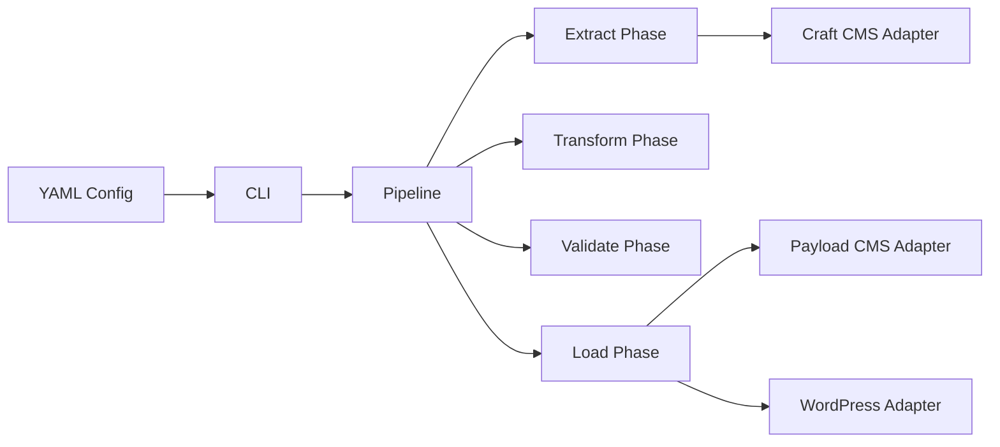

# cms-migration-toolkit

TypeScript CLI for migrating content between headless CMS platforms. Built on a pipeline/adapter pattern — swap source and target CMS without changing migration logic.

## Why

Headless CMS migrations are risky and manual. This toolkit provides:
- **Repeatable** — declarative YAML config, idempotent operations
- **Auditable** — full checkpoint logging, diff reports, dry-run mode
- **Safe** — dual-run strategy to validate before cutting over

## Architecture



## Quick Start

```bash
pnpm install
pnpm build

# Analyze source CMS
cms-migrate analyze --config migration.yml

# Dry run (no writes)
cms-migrate migrate --config migration.yml --dry-run

# Full migration
cms-migrate migrate --config migration.yml

# Post-migration validation
cms-migrate validate --config migration.yml

# Generate redirect map
cms-migrate redirects --config migration.yml --format nginx
```

## Tech Stack

| Technology | Version | Why |
|-----------|---------|-----|
| TypeScript | 6.0 | Strict typing across CMS schemas |
| Commander.js | 12 | CLI framework |
| Zod | 3 | Config validation |
| pino | 9 | Structured logging with file output |
| p-queue | 8 | Controlled concurrency for API rate limits |
| cli-progress | 3 | Live migration progress |

## Config File Format

```yaml
# migration.yml
source:
  type: craft
  url: https://old-site.com
  token: ${CRAFT_TOKEN}

target:
  type: payload
  url: http://localhost:3000
  apiKey: ${PAYLOAD_API_KEY}

contentTypes:
  - handle: article
    targetCollection: articles
    fieldMap:
      body: content
      heroImage: featuredImage

options:
  batchSize: 20
  concurrency: 3
  checkpoint: ./checkpoints
```

## Supported Adapters

| CMS | Direction | Protocol |
|-----|-----------|----------|
| Craft CMS | Source | GraphQL |
| Payload CMS | Target | REST |
| WordPress | Source/Target | REST |

## Commands

| Command | Description |
|---------|-------------|
| `analyze` | Inspect source CMS schema, count content |
| `migrate --dry-run` | Preview migration without writing |
| `migrate` | Run full migration with checkpoints |
| `validate` | Compare source vs target post-migration |
| `redirects --format nginx\|vercel\|nextjs` | Generate redirect map |

## Testing

```bash
pnpm test          # all tests
pnpm test:unit     # unit only
pnpm test:coverage # with report
pnpm test:ci       # CI mode
```

## License

MIT
