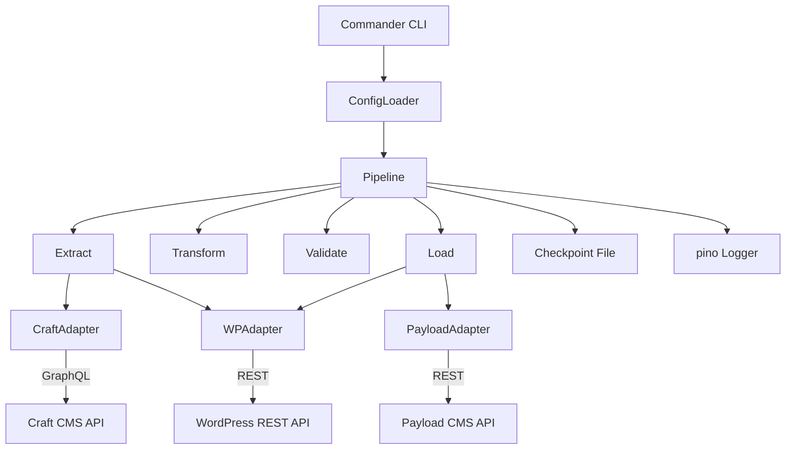

# Architecture

## Overview

The toolkit is a CLI application built around a four-phase pipeline. The pipeline is decoupled from CMS-specific logic through an adapter interface, so swapping the source or target CMS requires only a config change.

## Pipeline Stages

```
┌──────────┐    ┌───────────┐    ┌──────────┐    ┌──────┐
│ Extract  │ → │ Transform │ → │ Validate │ → │ Load │
└──────────┘    └───────────┘    └──────────┘    └──────┘
     │                │               │              │
  Fetch all       Map fields,     Schema check,   Write to
  entries from    apply field     count entries,  target CMS
  source CMS      rules, remap    diff reports    in batches
  in batches      slugs/assets
```

### Extract

- Connects to source CMS adapter
- Paginates through all entries using `getEntries(page, batchSize)`
- Writes raw entries to checkpoint file after each batch
- On resume, skips already-extracted pages

### Transform

- Applies `fieldMap` from config to rename fields
- Calls `FieldMapper` to convert field types (e.g. `craft:RichText` → `richText`)
- Resolves asset references to target-compatible format
- Normalizes slugs (lowercase, hyphens only)

### Validate

- Compares entry count in source vs target
- Checks required fields are present on all transformed entries
- Generates diff report: missing entries, field mismatches
- Blocks Load phase if critical errors found (override with `--force`)

### Load

- Skipped entirely in `--dry-run` mode
- Batches entries with `p-queue` (controlled concurrency)
- Calls `createEntry()` on target adapter
- Marks each entry as loaded in checkpoint to support resume
- Retries failed entries up to 3 times with exponential backoff

## Adapter Interface

```typescript
interface CMSAdapter {
  name: string;
  connect(): Promise<void>;
  disconnect(): Promise<void>;
  getContentTypes(): Promise<ContentType[]>;
  getEntries(contentType: string, page: number, pageSize: number): Promise<PagedResult<Entry>>;
  createEntry(contentType: string, data: Record<string, unknown>): Promise<Entry>;
}
```

All CMS-specific logic lives in the adapter implementation. The pipeline only calls this interface.

## Service Interaction Diagram



## Key Decisions

### Why Commander.js over yargs

Commander has a cleaner TypeScript API and smaller bundle. yargs has better auto-generated help for very complex CLIs, but the command surface here is small enough that Commander's manual help text is sufficient.

### Why p-queue over manual concurrency

p-queue provides a battle-tested priority queue with concurrency limits. Manual `Promise.all` with slicing does not handle errors per-item or support priority. Rate-limited CMS APIs require fine-grained concurrency control.

### Why YAML config over CLI flags

Migration configs need to be committed to version control, shared with teams, and replayed exactly. CLI flags are ephemeral. YAML config files are the source of truth and can be diff'd between runs.

### Why checkpoint files over a database

Checkpoint files are portable, require no infrastructure, and can be inspected with any text editor. A migration is typically a one-time operation — the overhead of standing up a database is not justified.
